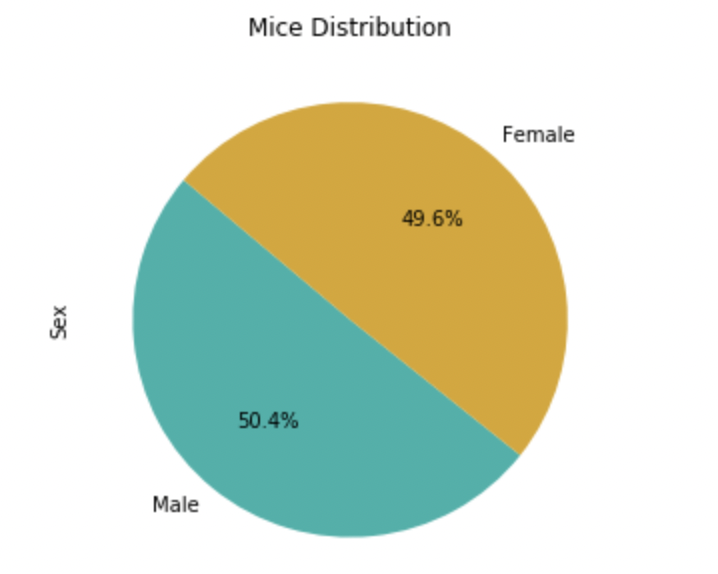
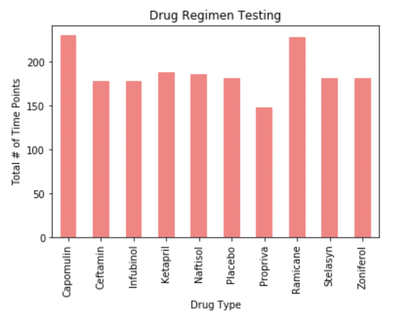
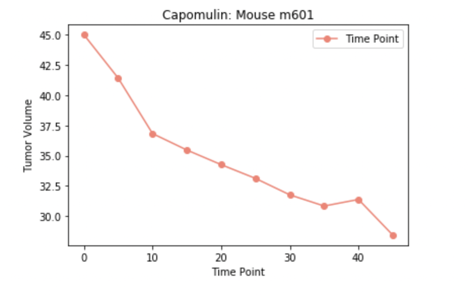

# Matplotlib Challenge
Exploring Matplotlib

## Three Observations from drug regimen study

<h3>Observation 1</h3>

For the pie chart, it can be observed that for the mice distribution more males were used in the study compared to females. This brings into question if there should have been an equal distribution of mice and if it would have played a role in the study as another factor to tumor sizes.
 

<h3>Observation 2</h3>

The bar chart presents us with the total timepoints for all mice that were tested for each drug regimen. Both Capomulin and Ramicane had the most time points when compared to the rest of the regimens. Regimens Ceftamin, Infubinol, Ketapril, Naftisol, Placebo, Stelasyn, and Zoniferol remained with similar timepoint totals with slight differences while Propriva remained as the regimen with the least amount of timepoints.

<h3>Observation 3</h3>

In the volume vs. time point line plot, mouse m601 was selected to analyze Capomulin. The line plot presents the tumIn the volume vs. time point line plot, mouse m601 was selected to analyze Capomulin. The line plot presents the tumor volume size change throughout the different time points. As the mouse was measured, the tumor size decreased. It can be inferred that Capomulin helped mouse m601 by decreasing its tumor size but more information would be needed before making that determination as other factors could have also played a role in the tumor reduction.

